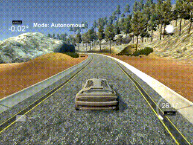

# CarND-Controls-PID
Self-Driving Car Engineer Nanodegree Program

---

## Dependencies and Basic Build Instructions

See [https://github.com/udacity/CarND-PID-Control-Project/blob/master/README.md]()

## PID Control

The core functionality is basically the PID::UpdateError function:
[https://github.com/balintfodor/CarND-PID-Control-Project/blob/master/src/PID.cpp#L24]()

```
void PID::UpdateError(double cte) {
    sum_cte += cte; // cumulative error
    p_error = Kp * cte; // Proporitonal term
    i_error = Ki * sum_cte; // Integral term
    d_error = Kd * (cte - prev_cte); // Derivative term
    prev_cte = cte;
}
```

The absolute error (**fabs(cte)**) is small if the car is on track and starts to increase when the car starts to leave the center of the track.

The **P** term tries to directly compensate for the error by steering to the opposite direction to the absolute error increases. The magnitude of the compensation is proportional to the error value. Using only the **P** term:



As the speed increases the amplitude of the oscillation grows. The higher the absolute error the stronger it tries to compensate with steering. Also, the driven distance between two control timestamps (subsequent calls of PID::UpdateError) is also increasing (with the speed) and the overshooting in the error grows too, resulting in an unstable car.

The **D** component is for short-term compensations. It reacts on the derivative of the error. So a huge change in the error will cause a rather large compensation. In the long term though, using only the **D** component can end up in an increasing offset.


Component **I** acts in the long term. It uses the cumulative error to steer the car back on track. Its effect is somewhat delayed since it takes time to integrate enough amount of error to react on. So, using only the **I** term will not give a quick response.


## Parameter Tuning

I used manual parameter tuning, following the heuristics from [https://courses.cs.washington.edu/courses/csep567/10wi/lectures/Lecture9.pdf]()

## Additional Tweaks

### Throttle

I used a simple way to set the throttle. If the absolute error **fabs(cte)** is small we can speed up. If it is large then we slow down so the steering has more time to compensate.

```
double throttle = 0.05;
if (fabs(cte) < 0.5) {
    if (fabs(cte) < 0.2) {
        throttle = 0.6;
    } else {
        throttle = 0.1;
    }
}
```

### Kp

The parameter for component **P** is slightly adjusted based on the speed. We want quick compensation when we are driving slow, so we want a higher value for the parameter. But the same parameter for a higher speed can cause oscillation, so we lower the parameter for the higher speeds.

```
pid.Kp = 0.15;
if (speed > 15) {
    if (speed > 30) {
        pid.Kp = 0.0375;
    } else {
        pid.Kp = 0.075;
    }
}
```

### Emergency Break 

If the absolute error is already high and the error derivative shows that the error is growing and our speed is above a certain level then this is a sign that we are going off track. So we can hit the break, slow down and hope that we have time to get back on track at a slower pace.

```
double throttle = 0.05;
if (fabs(cte) > 1.3 && pid.d_error > 0.005 && speed > 10) {
    throttle = -0.01;
}
```

